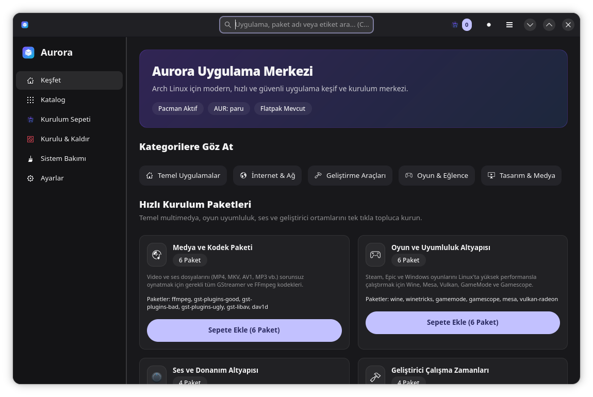

# Değişiklik Günlüğü (Changelog)

Bu projedeki tüm önemli değişiklikler bu dosyada belgelenir.
Format, [Keep a Changelog](https://keepachangelog.com/tr/1.0.0/) standardına dayanır ve bu proje [Semantik Sürümleme](https://semver.org/lang/tr/) kurallarını uygular.

---

## [0.1.0-alpha] - 2026-09-20

### 📸 Ekran Görüntüsü


### ✨ Eklenenler
- **Sistem Bakımı ve Temizlik Motoru:**
  - Pacman paket önbelleği disk boyutu ölçümü (`du -sh /var/cache/pacman/pkg`).
  - `paccache -r` (son 3 sürümü koruyarak temizleme) ve `paccache -ruk0` (kaldırılmış paket önbelleklerini silme) temizlik motoru.
  - `pacman -Qtdq` ile sistemde sahipsiz kalan yetim paketlerin tespiti ve güvenli temizliği (`sudo pacman -Rns`).
  - Başarısız systemd birimlerinin tespiti (`systemctl --failed`) ve servis yeniden başlatma kabiliyeti.
  - Canlı terminal akış konsolu (`InstallDialog::show_command_stream`).
- **Öncelikli Yakalama (Capture Phase) Klavye Kısayolları:**
  - Alt bileşenler odaklıyken dahi çalışan `Ctrl + 1..5` ve `Ctrl + KP_1..5` (Numpad) sekme geçişleri.
  - `Ctrl + F`: Arama kutusuna odaklanma ve arama metnini otomatik seçme.
  - `Esc`: Arama metnini tek tuşla temizleme ve aramadan çıkma.
  - `F5` / `Ctrl + R`: Sayfa ve depoları arka planda canlı yenileme.
  - `F1` / `Ctrl + ?`: Yeni yerel **Klavye Kısayolları Kılavuz Penceresi** (`ShortcutsWindow`).
  - `Ctrl + Q`: Uygulamadan güvenli çıkış.
  - GIO masaüstü eylemleri (`gio::SimpleAction`) ve `app.set_accels_for_action` tescili.
- **Toplu Kurulum Sepeti İçe ve Dışa Aktarımı:**
  - Sepetteki tüm paketleri `.txt` formatında dışa aktarma ve panoya kopyalama.
  - Panodan veya metin listelerinden yorum satırlarını (`#`) filtreleyerek toplu paket içe aktarma.
- **Ninite Hızlı Kurulum Modu ve 28 Yeni Sistem Paketi:**
  - Medya ve Kodek Paketi (FFmpeg, GStreamer, Dav1d).
  - Linux Oyun ve Uyumluluk Altyapısı (Wine, Winetricks, GameMode, Gamescope, Mesa, Vulkan).
  - Modern Ses ve Donanım Altyapısı (PipeWire, WirePlumber, BlueZ).
  - Geliştirici Çalışma Zamanları (Python, Node.js, OpenJDK Java, .NET SDK).
- **Çoklu Depo Yönetimi ve Kaynak Ayrımı:**
  - Pacman resmi depoları, bağımsız AUR RPC v5 araması ve Flatpak entegrasyonu.
  - `pacman -Qm` ile yerel ve yabancı paketlerin ayrımı (`OFFICIAL`, `AUR`, `FLATPAK` rozetleri).
  - Kurulu uygulamalar listesinden doğrudan kaynak duyarlı güvenli kaldırma (`UninstallDialog`).
- **Açık Kaynak Katkı Altyapısı:**
  - Detaylı [Katkıda Bulunma Rehberi (CONTRIBUTING.md)](CONTRIBUTING.md).
  - Başlık çubuğunda GNOME HIG standartlarında Ana Menü butonu (`open-menu-symbolic`).
  - Ayarlar sayfasında "Geliştirme ve Topluluk Katkısı" paneli.
  - Libadwaita `adw::AboutDialog` üzerinde yerel "Sürüm Notları (Yenilikler)" penceresi.

### 🔒 Güvenlik
- Kritik çekirdek paket koruması (`glibc`, `linux`, `systemd`, `pacman`) yetim paket temizliğinden ve kaldırma işlemlerinden muaf tutuldu.
- Shell enjeksiyonlarına karşı sıkı regex paket adı doğrulaması (`is_valid_package_name`).
- Root kullanıcısı altında başlatıldığında güvenlik uyarı şeridi (Banner).

---

## 📝 Yeni Bir Özellik Eklendiğinde Nasıl Güncellenir?

Gelecekte yeni bir sürüm yayınlandığında bu dosyaya aşağıdaki şablon takip edilerek yeni bir blok eklenir:

```markdown
## [0.2.0-alpha] - YYYY-AA-GG

### 📸 Ekran Görüntüsü


### ✨ Eklenenler
- **Özellik Adı:** Özelliğin ne işe yaradığı ve nasıl çalıştığının kısa açıklaması.

### ⚡ İyileştirmeler
- Mevcut bileşenlerde yapılan performans veya arayüz geliştirmeleri.

### 🐛 Düzeltilenler
- Çözülen hatalar ve kullanıcı bildirimleri.
```
